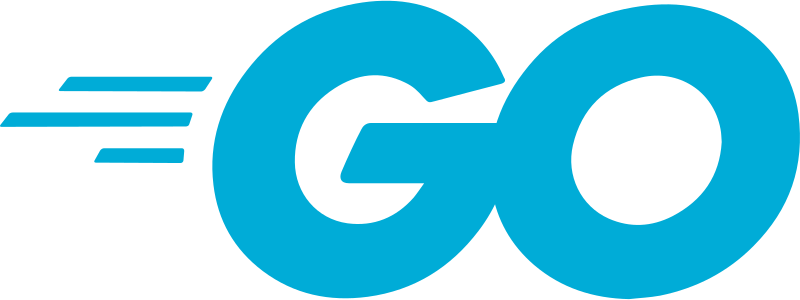

# Summary

Hi, my name is Ilya, I am a 5th-year student of Bauman Moscow State Technical University (Faculty of Computer Science and Control Systems) and I am also a student of the VK Education program (ML developer).

# My technical stack

* Languages:\
 
 

* Frameworks & Tools:\

# Projects
* [MusicTranscription](https://github.com/ilya0100/MusicTranscription) - Neural network that converts audio signal into note sequence
* [StartYourProject](https://github.com/ilya0100/StartYourProject) - Social network for teammates search (backend, C++, Boost.Beast)
* [ChessMate](https://github.com/ilya0100/ChessMate) - Chess (C++, game engine)
* [Huffman code](https://github.com/ilya0100/Alg-And-DS-2022-Spring/tree/module-2/haffman) - Implementation of the algorithm in c++
* [Search for an increasing sequence](https://github.com/ilya0100/hw-2-AdvC-2022-Spring) - Multiprocessing for large amounts of data (С)

# Courses
* [Prepare C++](https://park.vk.company/curriculum/certificates/download/2931/9884a155-3f73-409f-beb1-537e61dabf05/) - VK Education course
* [Introduction to Programming C++](https://stepik.org/cert/965592)
* [Python Generation](https://stepik.org/cert/1383269)
* [Algorithms and data structures](https://github.com/ilya0100/Alg-And-DS-2022-Spring)
* [Deep Python](https://github.com/ilya0100/DeepPythonHW)
